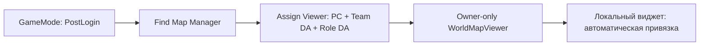

# Атлас Blueprint-нод

Названия ниже соответствуют C++ API; редактор обычно добавляет пробелы: `AssignViewer` → **Assign Viewer**. Для поиска используйте категорию **World Map** или тяните провод из ссылки на нужный объект.

Обозначения:

- **Server** — обычная authority-only функция, НЕ RPC. Клиентский вызов не отправляет запрос серверу и ничего не меняет.
- **Local** — UI/локальное представление.
- **RPC** — явный запрос через принадлежащий клиенту viewer; сервер проверяет параметры.
- **Pure** — чтение/преобразование без exec-пинов.

Большинство ключей — ссылки на DA. `FGuid` используется, когда требуется отличить экземпляры одного определения или идентифицировать область исследования. `Floor.SortOrder` задаёт порядок кнопок, но не является ключом поиска.

## Manager: поиск и назначение

Target — `WorldMapManager`. Статические функции поиска доступны без экземпляра.

| Нода | Где | Вход → результат | Назначение |
|---|---|---|---|
| `FindMapManager` | Pure | World Context → Manager | Менеджер текущего UWorld. Размещайте один на мир |
| `FindLocalViewer` | Pure, Local | World Context, PlayerController → Viewer | Только локальный PC и его owner-only actor; до репликации может быть null |
| `AssignViewer` | Server | PlayerController, Team DA, ViewerRole DA → Viewer | Создать/заменить доступ игрока. Team обязателен, Role необязателен |
| `RemoveViewer` | Server | PlayerController | Удалить сессию, viewer и его командные пинги |
| `RefreshViewers` | Server | — | Немедленно собрать разрешённые выборки; обычно вызывается таймером менеджера |

## Manager: элементы

| Нода | Где | Вход → результат | Назначение |
|---|---|---|---|
| `RegisterElement` | Server | Element, ExplorationId, OwningTeam DA, TransformSource → GUID | Регистрирует описание. Если Id отсутствует, создаёт. При ошибке возвращает invalid GUID |
| `UnregisterElement` | Server | Id, KeepSnapshot → bool | Удаляет элемент или фиксирует геометрию без живого источника |
| `SetElementState` | Server | Id, State DA → bool | Обновляет игровое состояние; наблюдения сохраняют прежний снимок до нового сообщения |
| `SetElementPlacement` | Server | Id, Map DA, Floor DA, Transform → bool | Меняет размещение; при живом TransformSource изменяет его world transform |
| `FindRegisteredElementsByDefinition` | Server | Element DA → Elements[] | Все серверные экземпляры данного определения; на клиенте возвращает пустой массив |

`TransformSource` необязателен. Если задан, менеджер берёт текущую трансформацию SceneComponent при создании представления/наблюдения. Для статической геометрии можно передать только Transform. Не используйте `SetElementPlacement` как неконтролируемый клиентский способ перемещения игрового объекта.

`FWorldMapElement`:

| Поле | Смысл |
|---|---|
| `Id` | Уникальный runtime-экземпляр |
| `Map`, `Floor` | DA карты и этажа |
| `Definition` | DA типа элемента, стиля, формы и политики |
| `State` | Разрешённый для наблюдателя DA состояния; может быть null |
| `Transform` | Трансформация локальной формы в мировой системе координат |
| `bLastKnown` | Полученная метка — память о наблюдении, а не актуальное отслеживание |

## Manager: исследование и наблюдения

| Нода | Где | Вход → результат | Назначение |
|---|---|---|---|
| `ExploreElementForTeam` | Server | Team DA, ElementId → bool | Открывает группе область исследования этого элемента |
| `ExploreElementsByDefinition` | Server | Team DA, Element DA → count | Открывает области ВСЕХ зарегистрированных экземпляров данного DA |
| `GetExploredAreaIds` | Server | Team DA → GUID[] | Экспорт для SaveGame проекта |
| `RestoreExploredAreaIds` | Server | Team DA, GUID[] | Добавляет сохранённые области; не очищает существующие |
| `ReportObservation` | Server | Team DA, ElementId, Observation DA, Observer Actor → bool | Записывает актуальный снимок по конкретному источнику |
| `EndObservation` | Server | Те же ключи, KeepMemory | Завершает актуальность одного источника; по желанию оставляет память |

Ключ наблюдения: **Team + ElementId + Observation DA + Observer Actor**. Две камеры с одним Observation DA не перезаписывают друг друга, если у них разные Observer Actor. Повторный Report обновляет только свой источник. Завершение одного не отменяет остальные.

`ExploreElementsByDefinition` — намеренно широкая операция: если один DA описывает десять одинаковых комнат, откроются все десять. Для одной комнаты берите `ElementId` у её серверного компонента.

## Manager: переопределяемые события

| Событие | Стандартное поведение | Как расширять |
|---|---|---|
| `CanViewerReceiveElement(Context, Element)` | Разрешает после встроенных проверок | Добавить серверное ограничение, например состояние задания. Получает уже отредактированное представление |
| `CanCreatePing(PlayerController, Definition, ServerLocation)` | Разрешает после встроенных проверок | Запретить пинг во время оглушения, проверить заряд способности |

События не могут отменить встроенные audience/knowledge/range/cooldown проверки: они выполняются после них. Не выполняйте в этих событиях регистрацию/удаление элементов или смену viewer — это predicates, которые вызываются во время обхода реестра. Изменения откладывайте до следующего события игрового кода.

## Viewer: разрешённые данные

Target — `WorldMapViewer`, найденный для локального PlayerController.

| Нода | Где | Вход → результат | Назначение |
|---|---|---|---|
| `GetVisibleElements` | Pure | → Elements[] | Разрешённая серверная выборка плюс личные локальные метки |
| `FindElementsByDefinition` | Pure | Element DA → Elements[] | Поиск разрешённых экземпляров по DA |
| `FindElementsByMapAndFloor` | Pure | Map DA, Floor DA → Elements[] | Только соответствующая карта и этаж |
| `FindElementById` | Pure | Id → bool, Element | Один разрешённый экземпляр; при отсутствии Element очищается |
| `GetViewerContext` | Pure | → Team DA, Role DA | Контекст, назначенный сервером |
| `GetCurrentMap` | Pure | → Map DA | Карта физического положения игрока |
| `GetCurrentFloor` | Pure | → Floor DA | Физический этаж после задержки переключения |
| `GetManager` | Pure | → Manager | Публичный менеджер; его приватный реестр клиенту не доступен |

`OnMapChanged` — multicast dispatcher для UI: изменения разрешённых элементов, локальных меток или текущего этажа. Подписывайтесь один раз и отписывайтесь при уничтожении виджета. Нативный map-widget делает это сам.

## Viewer: метки

| Нода | Где | Вход → результат | Назначение |
|---|---|---|---|
| `ServerRequestPing` | RPC, Unreliable | Ping DA, Map DA, Floor DA, WorldXY | Проверяемый запрос на командный пинг; сервер определяет Z, команду и время жизни |
| `AddPersonalMarker` | Local | Element DA, Map DA, Floor DA, Location → GUID | Локальная заметка. Не сообщает о враге и не открывает исследование |
| `RemovePersonalMarker` | Local | GUID → bool | Удаляет только личную заметку |

RPC не возвращает подтверждение. Принятый пинг появится в выборке и вызовет `OnMapChanged`. При потере пакета unreliable-пинг может не появиться; это не критичное игровое действие. Не добавляйте в этот RPC параметры команды, роли, цели-актора, срока жизни или произвольного текста без отдельной серверной модели проверки.

## Element Component

Target — `WorldMapElementComponent`, который добавляется в Actor Blueprint через Add Component.

| Нода | Где | Назначение |
|---|---|---|
| `RegisterWithManager(Manager)` | Server → GUID | Регистрирует настроенный компонент, повторный вызов возвращает его текущий Id |
| `UnregisterFromManager(KeepSnapshot)` | Server | Отключает источник и удаляет/сохраняет запись |
| `GetElementId` | Pure → GUID | Действителен на сервере после регистрации; не реплицируется самим компонентом |
| `GetResolvedExplorationId` | Pure → GUID | Локальный ExplorationId, объединённый с namespace экземпляра |

Настройте свойства компонента до регистрации. После регистрации изменения `Definition`, `Map` и `Floor` напрямую в полях компонента не являются автоматическим обновлением записи. Для смены полного описания снимите регистрацию и зарегистрируйте снова; для состояния/размещения используйте менеджер. Изменения трансформации живого компонента отслеживаются автоматически.

## Region Actor

| Нода / событие | Где | Назначение |
|---|---|---|
| `RegisterRegionWithManager(Manager)` | Server | Регистрирует элемент и объём для определения этажа/исследования |
| `ContainsLocation(WorldLocation)` | Pure, BlueprintNativeEvent | Проверка нахождения внутри; по умолчанию ориентированный Box |
| `GetRegionPriority` | Pure → int | Приоритет из Region DA при пересечении объёмов |

Можно переопределить `ContainsLocation` для составных объёмов. Авторитетное решение всё равно вызывается сервером с серверной позицией Pawn. Регистрация только MapElement не включает объём в список определения этажей — для процедурного Region используйте именно `RegisterRegionWithManager`.

## Общие ноды обоих виджетов

Target — `WorldMapWidget`, `WorldMapMinimapWidget` или `WorldMapFullMapWidget` и их BP-наследники.

| Нода | Вход → результат | Поведение |
|---|---|---|
| `BindViewer` | Viewer | Привязать viewer своего Owning Player; null очищает выборку |
| `GetViewer` | → Viewer | Текущая привязка |
| `SetDisplayedFloor` | Map DA, Floor DA → bool | Выбрать этаж вручную, отключить автоэтаж |
| `GetDisplayedMap` | → Map DA | Карта этого виджета |
| `GetDisplayedFloor` | → Floor DA | Просматриваемый этаж, может отличаться от физического |
| `CenterOnPlayer` | — | Вернуть центр, этаж и следование |
| `SetFollowPlayer` | bool | Включить/выключить слежение за центром и этажом |
| `SetMapCenter` | WorldXY | Задать центр и отключить слежение за центром |
| `SetZoom` | NewZoom | Ограничить масштаб Min/Max из View DA |
| `GetZoom` | → float | Slate units на Unreal unit (обычно сантиметр) |
| `ZoomAtLocalPosition` | NewZoom, LocalPosition | Сохранить точку под курсором; в follow-режиме сохранить центр игрока |
| `SetDefinitionFilter` | Element DA[] | Пустой список = все разрешённые типы; непустой = только перечисленные |
| `WorldToWidgetPosition` | WorldLocation → LocalXY | Общая проекция с учётом камеры и поворота |
| `WidgetToWorldPosition` | LocalXY → WorldLocation | Обратная проекция; Z = Floor.ReferenceWorldZ, не трассировка поверхности |
| `FindElementAtLocalPosition` | LocalXY → bool, Element | Верхний интерактивный элемент на выбранном этаже с учётом фильтров |
| `RequestPingAtLocalPosition` | Ping DA, LocalXY | Преобразовать XY и вызвать проверяемый viewer RPC |

LocalPosition — координаты внутри виджета в Slate units, не абсолютные пиксели монитора. Для мыши используйте Geometry.AbsoluteToLocal. DPI уже учитывается преобразованием геометрии; не применяйте второй раз масштаб viewport.

### Dispatcher-события виджетов

| Событие | Данные |
|---|---|
| `OnElementClicked` | Разрешённый Element при клике без перетаскивания |
| `OnMapClicked` | Мировая позиция при клике по пустому месту |
| `OnHoveredElementChanged` | bHasElement и Element; при выходе bHasElement=false |

### Tooltip

| Нода / событие | Назначение |
|---|---|
| `SetMapElement(Element)` | Задать разрешённый снимок и вызвать обновление |
| `UpdateFromMapElement(Element)` | BlueprintImplementableEvent: заполнить собственные Text/Image/кнопки |
| `MapElement` | Read-only свойство текущего снимка |

Не используйте display name DA как идентификатор, `Get All Actors Of Class` на клиенте для поиска скрытых целей или игровой Actor как обязательный источник tooltip. Опирайтесь на полученный Element и DA-ключи.
