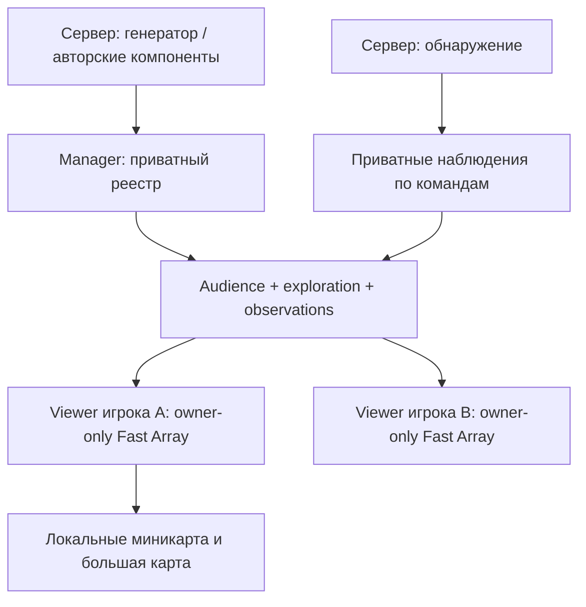

# Руководство разработчика

[Обзор плагина](../README.md) | [Индекс документации](README.md)

## Модель данных

Data Asset — идентичность **типа/описания**, GUID — идентичность **экземпляра**. Один `DA_Room_Laboratory` может описывать сотню комнат. Поэтому функции `Find…ByDefinition` возвращают массив, а `FindElementById` — конкретный элемент.

Все публичные UObject-классы помечены `BlueprintType, Blueprintable`. Можно наследовать DA, менеджер, viewer, region, компонент, оба виджета и tooltip. У `WorldMapDescriptor` абстрактная база с DisplayName/Description. USTRUCT/enum используются для фундаментальных структур и алгоритмов; UE не поддерживает наследование таких структур в BP.

Настройки поведения/вида находятся в DA. Размещение, идентификатор экземпляра, namespace генерации, принадлежность конкретного объекта к команде и параметры его жизненного цикла остаются на экземпляре компонента/актора.

| DA | Ответственность |
|---|---|
| `WorldMapDefinition` | Карта/комплекс, допустимые этажи, разрешение публичных outdoor-пингов |
| `WorldMapFloorData` | Название, порядок, опорный Z для публичных пингов/обратной проекции |
| `WorldMapTeamData` | Идентичность аудитории общего исследования и обнаружений |
| `WorldMapRoleData` | Дополнительные права; в v0.1 — обход требования исследования |
| `WorldMapVisibilityData` | Audience AND reveal-rule: Always / Explored / Observed |
| `WorldMapShapeData` | Rectangle / простой Polygon / Polyline / Point |
| `WorldMapStyleData` | Цвет, заливка/кисть, контур, размер, диапазон масштаба, last-known opacity |
| `WorldMapStateData` | Состояние, override стиля, дополнительная политика доступа к состоянию |
| `WorldMapElementData` | Тип элемента: форма, стиль, политика, порядок, интерактивность и tooltip |
| `WorldMapPingData` | Наследник Element: дальность и срок жизни серверного пинга |
| `WorldMapObservationData` | Длительность актуальности и памяти источника обнаружения |
| `WorldMapRegionData` | Размер объёма, приоритет, исследование по входу, выбор этажа |
| `WorldMapSettings` | Серверный интервал, бюджет дельты, класс viewer, ограничения пингов |
| `WorldMapViewData` | Масштаб, поведение мыши, следование, поворот, размеры и цвет UI |

## Жизненный цикл и сеть



Один manager на UWorld; он должен жить на persistent level. Полный Registry, Knowledge, Observations и Sessions — `Transient`, без `Replicated`. Сам актор реплицируется всем; его Settings не содержат приватных экземпляров мира. Никакой subsystem-менеджер не нужен.

GameMode назначает viewer после входа/определения команды. Каждый viewer принадлежит конкретному PlayerController. Встроенная relevancy проверяет владельца; его данные дополнительно используют `COND_OwnerOnly`.

Регистрация авторских компонентов выполняется только на сервере. Manager в BeginPlay регистрирует уже существующие компоненты, а компоненты в своём BeginPlay находят уже существующий manager. Для поздней процедурной загрузки используйте явную регистрацию, если auto-register выключен.

Менеджер с заданным RefreshInterval определяет области игроков, удаляет истёкшие наблюдения/пинги и пересобирает разрешённые представления. Изменения отправляются Fast Array; неизменившиеся записи не помечаются dirty. Бюджет ограничивает добавления/изменения за шаг. Изменения трансформаций обходятся циклически, чтобы большие наборы движущихся маркеров не голодали постоянно на одних и тех же последних индексах.

При массовом отзыве данных, превышающем бюджет, viewer заменяется целиком вместо слишком большой Fast Array delta. Виджет очищает данные уничтоженного viewer и автоматически находит новый. При смене команды/роли viewer тоже заменяется; данные новой команды никогда не записываются в общий с ней старый объект.

Сетевое обновление не мгновенно: частота менеджера, частота репликации, бюджет и сеть определяют задержку. Критическую игровую проверку не выполняйте по UI.

## Видимость

Сначала проверяется audience: ограничения команды и роли одновременно. `bOnlyOwningTeam` требует ненулевую OwningTeam. Затем reveal-rule:

- Always — исследование не требуется.
- Explored — команда открыла ExplorationId или сервером назначена роль с обходом исследования.
- Observed — существует неистёкшее наблюдение этой команды; роль с обходом исследования здесь не помогает.

После встроенных правил вызывается `CanViewerReceiveElement`. Его BP-override может добавить ограничения, но не расширить запрещённый базовыми правилами доступ. Predicates не должны менять реестр во время обхода.

У состояния может быть дополнительный Visibility DA. Тогда клиент получает видимую геометрию, но поле State будет null, пока не разрешены сведения. Для observed-состояния используется снимок наблюдения. У самого State DA есть описание, поэтому не назначайте приватный DA состояния публичному полю другого реплицируемого объекта проекта.

## Обнаружение

Источники различаются по Team, ElementId, Observation DA и Observer Actor. Report берёт текущую серверную трансформацию и сохраняет весь разрешаемый позже снимок. Дальнейшее движение игрового актора не обновляет запись до нового Report.

При выборе между источниками сначала предпочитается актуальное наблюдение, затем более новое в той же категории. Память содержит старый этаж и состояние вместе с позицией. `EndObservation` не продлевает память при повторном завершении того же источника.

Плагин не делает line-of-sight, не решает, кто враг, и не принимает такие решения от клиента. Подключите серверный AI Perception, свою систему зрения или валидируемую способность. Нельзя добавлять обходной RPC, который без проверки вызывает ReportObservation по заявлению клиента.

## Геометрия и этажи

Форма задаётся в локальной плоскости XY и преобразуется Transform в мир. На карте +X направлен вверх, +Y вправо. Поворот карты задаётся в градусах относительно этой конвенции. Все mouse-hit и world/widget-преобразования используют одну и ту же проекцию.

Polygon: простой многоугольник без отверстий, до 256 вершин, без повторения последней вершины. Поддерживается вогнутая форма; самопересечения и вырожденные контуры отвергаются при регистрации. Для отверстий или сложного помещения используйте несколько элементов с общей областью исследования. Polyline рисуется с экранной толщиной Style.LineThickness. Point имеет экранный размер Style.MarkerSize.

Style.Icon используется как кисть точечного маркера либо текстурная заливка контура. Для художественной карты города используйте прямоугольный элемент с текстурой, настроенным FillColor и политикой Always; поверх него размещайте отдельные интерактивные элементы.

Region использует самостоятельный Box и серверную позицию Pawn. При пересечении выигрывает больший Priority, затем меньший размер box. Переключение этажа требует непрерывного нахождения в кандидате в течение FloorSwitchDelay. Вне областей сохраняется последний известный этаж. Лестницу можно размечать несколькими областями перехода; многоэтажный зал — несколькими изображениями на разных Floor DA.

Физический этаж хранится в viewer, выбранный для просмотра — в каждом widget. `bResolveFloorFromRegions` у Element DA позволяет динамическому маркеру получать этаж области при создании снимка.

## Генерация, стриминг и сохранение

Для повторяемых комнат ключ элемента — `FGuid::Combine(InstanceNamespace, LocalElementId)`. Область исследования строится аналогично из локального ExplorationId, либо LocalElementId, если он не задан.

Назначайте namespace на сервере одинаково всем элементам одного экземпляра. Для сохранений генератор должен сохранять/восстанавливать namespace и локальные IDs; новая случайная генерация без сохранения идентификаторов не сможет применить старую разведку. DA задаёт тип, а не подменяет runtime-идентичность.

При `EndPlay(RemovedFromWorld)` компонент с RememberAfterStreamingUnload сохраняет финальную трансформацию в реестре и отвязывает живой source. При возврате комнаты тот же Id восстанавливает источник. Destroyed и явное удаление удаляют запись и наблюдения. Новый procedural run должен использовать новые namespace либо явно очистить записи старого run.

`GetExploredAreaIds` / `RestoreExploredAreaIds` — интерфейс интеграции со своим SaveGame. Сохраняйте также привязку к карте, seed/версии генерации, namespace экземпляров и командной идентичности. Сам manager живёт только в текущем мире; не ожидайте сохранности при travel без явного экспорта/импорта.

## UI и расширение

`WorldMapWidget` — общая UMG-обёртка с нативной Slate-отрисовкой. Обновления данных подписаны на OnMapChanged. NativeTick используется одним viewport-виджетом для следования и hover; отдельный виджет на каждую комнату не создаётся. Blueprint Designer остаётся доступен для рамок, кнопок и панелей поверх карты.

Tooltip получает только FWorldMapElement. Для действий по Id сервер заново проверяет полномочия, расстояние и актуальность объекта. Существование карточки на клиенте не даёт права открыть дверь или атаковать цель.

Персональные маркеры локальны, не имеют сохранения автоматически и исчезают при замене viewer. Если нужен постоянный блокнот, сохраняйте его отдельно на уровне игрока и восстанавливайте по правилам проекта.

Для публичного города предусмотрены масштабные фильтры стиля, отбор текущей карты/этажа и отбрасывание элементов за экраном. Следующий шаг при больших объёмах — серверный пространственный индекс, группировка геометрии, кластеризация маркеров и ограничение частоты отдельных категорий. Их необходимость определяется профилированием в целевом проекте.

## Подключение из C++

Добавьте `WorldMapSystem` в зависимости модуля проекта. Для типов API включайте нужные публичные заголовки:

```cpp
#include "WorldMapManager.h"
#include "WorldMapViewer.h"
#include "WorldMapElementComponent.h"

// Trusted server path after the game has assigned a team and role.
if (AWorldMapManager* MapManager = AWorldMapManager::FindMapManager(this))
{
    MapManager->AssignViewer(PlayerController, TeamAsset, RoleAsset);
}
```

Не включайте private headers и не используйте внутренние записи сервера как клиентский UI API. Для проверки конкретных сценариев используйте тесты и сетевую матрицу из [Testing](Testing.md).
